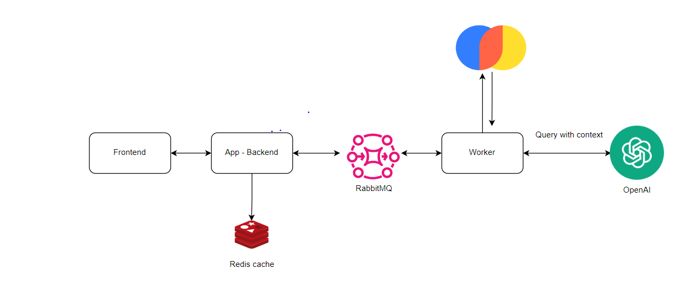

# Study 2023/2024 Chatbot

# Exam Preparation Chatbot

## Overview

This project aims to develop a **chatbot application** designed to help students prepare for exams using **Artificial Intelligence (AI)** and **Natural Language Processing (NLP)**. The chatbot provides personalized study guidance, answers queries, and offers resources to improve students' exam readiness, all while creating a supportive and engaging learning environment. 

The bot primarily relies on **PDF documents** as the source of knowledge and uses **semantic search** powered by **Vector Embeddings** to provide highly relevant responses based on the user's query.

---

## Features

- **Personalized Exam Guidance**: Provides tailored advice and study suggestions based on content in PDF documents.
- **Semantic Search**: Uses **VectorDB** and **NLP embeddings** to find the most relevant answers rather than relying on keyword matching.
- **Dynamic Query Handling**: Supports various student queries such as exam topics, important concepts, and practice questions.
- **Efficient Query Management**: Integrates **RabbitMQ** for API request queuing, ensuring the system handles high loads without crashing.

---

## System Flow

### 1. **Document Upload & Parsing**

The system relies on **PDF documents** as the primary source of information. These documents contain all the content the chatbot uses to provide answers. When documents are uploaded, they are parsed and processed to create **semantic embeddings**.

### 2. **Vector Embeddings for Semantic Search**

Instead of relying on simple keyword matching, the chatbot uses **vector embeddings** to understand the meaning behind words and phrases. The PDF documents and user queries are converted into vector embeddings using **NLP models** like OpenAI's embeddings.

- **How It Works**: When a student asks a question, the query is converted into a vector. This vector is then compared with precomputed document embeddings to find the most relevant response.

### 3. **Search Mechanism**

Once a query is processed, the chatbot performs a **similarity search** by comparing the user's query vector against stored document vectors. The most relevant document or snippet is retrieved to answer the query.

---

## Key Design Components

### **VectorDB for Semantic Retrieval**
- **Why Embeddings?**: Embeddings enable the chatbot to find content based on meaning rather than exact phrase matching, making the search more intelligent.
- **Search Efficiency**: **Precomputed relationships** (like “Top Algebra questions”) are stored for faster retrieval. **Caching** using Redis is also applied to avoid repeated computation for common queries.

### **API Request Handling with RabbitMQ**
To prevent system overload, incoming API requests are queued using **RabbitMQ**. This ensures requests are processed sequentially, even during high traffic, ensuring reliability and smooth user experience.

---

## Concurrency & Scalability

### **Concurrency Solutions**
- **Duplicate Handling**: The system is designed to be **idempotent**, meaning multiple requests for the same information will yield the same result. **Message deduplication** is handled using correlation IDs.
- **Task Distribution**: With **dynamic worker scaling**, the system ensures tasks are distributed evenly to avoid delays. The number of workers is adjusted based on queue length.
- **Atomic Updates to VectorDB**: Updates to the VectorDB are handled atomically to avoid data inconsistency, especially during vectorization. **Read-write locks** allow for concurrent reads without conflicting with writes.

### **Caching for Speed**
- **Redis Caching**: Frequently asked queries, such as common exam topics, are cached to ensure quick responses without recalculating every time.

---

## Future Enhancements

- **Scalability**: The system will be further optimized to handle an increasing number of users and documents, especially as the user base grows.
- **Improved AI Models**: Future versions of the bot will integrate more accurate AI models for even better, personalized study guidance.
- **LMS Integration**: Integration with **Learning Management Systems (LMS)** could be explored to streamline access to study materials directly from the platform.

---

## Technologies Used

- **Natural Language Processing (NLP)**: For text analysis and vector embedding creation.
- **Vector Embeddings**: Powered by models like **OpenAI's Embeddings**.
- **RabbitMQ**: For queuing requests and handling high API traffic efficiently.
- **Redis**: For caching frequent queries.
- **VectorDB (ANN Indexing)**: For fast semantic search using algorithms like **HNSW** and **FAISS**.

---

## Conclusion

This project integrates cutting-edge technologies like **NLP**, **semantic search**, and **queue management** to create a powerful chatbot that assists students in preparing for exams. It offers a personalized, efficient, and scalable solution that ensures a smooth and engaging learning experience.


## Architecture


- Worker       : Worker does the heavy lifting. It retrives similar data from vectorDB (Chroma DB)

- Backend App  : Its the app exposing backend API to frontend. It also updates results in redis cache

- Frontend     : Frontend interacts with backend-api and gives back the result

- Rabbit MQ    : Message queue has prompts and results channel through which backend and worker interact with for asynch communication.

- OpenAI API : We are using 'GPT-3.5-turbo' model and restricting the context with the information retreival done from vector DB

- Redis : To cache prompts and its result for faster response.


## How to run
### Prerequisites
Install following
1. Docker
2. Node.js
3. Python

### Run RabbitMQ and Redis in Docker :
```bash
cd  docker

docker-compose up -d
```


### To Run the Front End 
```bash
 cd frontend
 npm install
 npm start
```

### install pythin dependencies
```bash
 pip install -r requirements.txt
```
### To run worker
```bash
 python source/worker.py
```

### To run app
```bash
 python source/searchDB.py
```

### open frontend in browser :
open in browser :
http://localhost:3000/


Feel free to contribute or fork this repository to help enhance the system, add new features, or improve scalability!